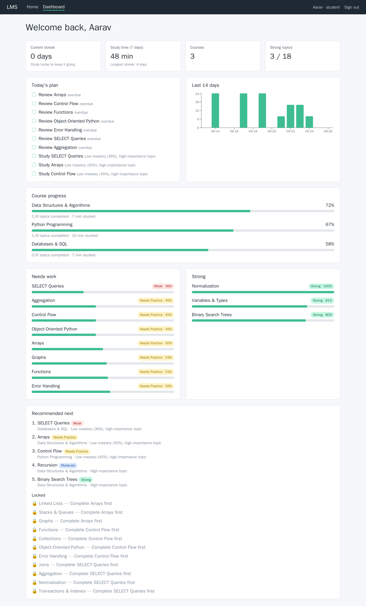
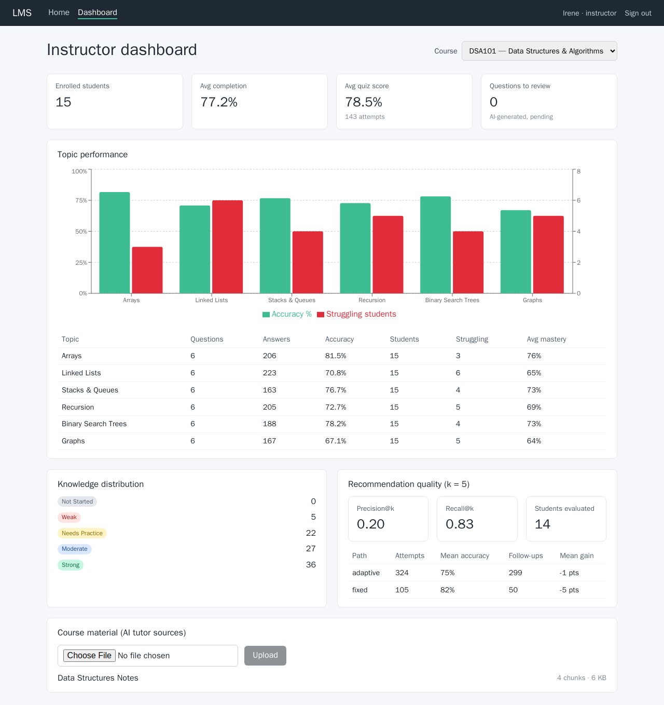
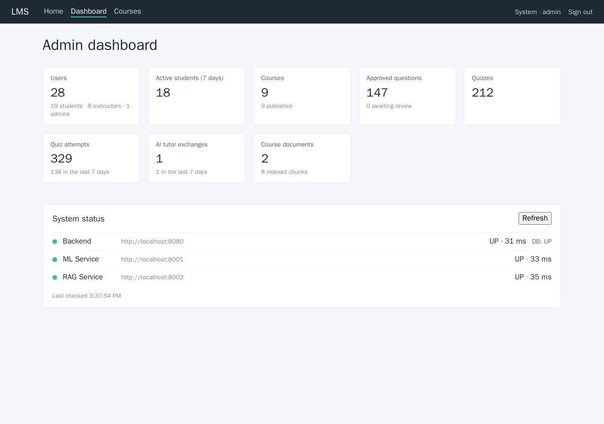
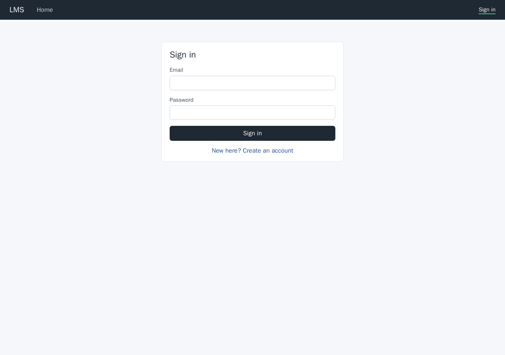

# Learning Management System

An adaptive learning platform: instructors build courses with a prerequisite graph and a question bank; students
take diagnostic, practice and adaptive quizzes; an ML service scores per-topic knowledge and ranks what to study
next; and an AI tutor (Claude) answers questions grounded in uploaded course material.

| Student dashboard | Instructor dashboard |
|---|---|
|  |  |
| **Admin dashboard** | **Sign in** |
|  |  |

## Architecture

| Service | Stack | Port | Responsibility |
|---|---|---|---|
| `frontend` | React 18 + Vite, Recharts, served by nginx | 5173 | Sign-in and the student / instructor / admin dashboards |
| `backend` | Spring Boot 3.3, Java 21, Spring Security (JWT) | 8080 | All business logic and data; the only service the browser needs |
| `ml-service` | FastAPI | 8001 | Knowledge scoring and recommendation ranking (pure functions) |
| `rag-service` | FastAPI, sentence-transformers, FAISS, Anthropic SDK | 8002 | Document ingestion, retrieval and the AI tutor; holds the LLM key |
| `postgres` | PostgreSQL 16 (+ pgvector image) | 5432 | Primary database |

The backend calls `ml-service` after every quiz submission and when building recommendations, and calls
`rag-service` for uploads and tutor turns. Both calls degrade gracefully: if ml-service is down, submissions still
succeed (knowledge keeps its last score) and recommendations fall back to the last stored ranking.

## Quick start (Docker)

```bash
cp .env.example .env          # then set ANTHROPIC_API_KEY for the AI tutor (optional)
SEED_DEMO_DATA=true docker compose up --build -d     # PowerShell: $env:SEED_DEMO_DATA="true"; docker compose up --build -d
```

Open http://localhost:5173 and sign in with a demo account (password `Demo12345!` for all of them):

| Role | Email |
|---|---|
| Student | `student01@demo.lms` … `student15@demo.lms` |
| Instructor | `instructor1@demo.lms` (DSA101, PY101), `instructor2@demo.lms` (DB101) |
| Admin | `ADMIN_EMAIL` / `ADMIN_PASSWORD` from `.env` |

The demo dataset (3 courses, 18 topics, 108 questions, 15 students, three weeks of activity) is loaded once by
`DemoDataSeeder`. Student answers are **simulated** (each is correct with a probability from the student's ability
and the question difficulty); everything derived from them - progress, knowledge, recommendations, analytics - is
computed by the real services. Evaluation numbers on the demo data therefore say nothing about real learners.

To try the RAG tutor, upload [docs/sample-material/data-structures-notes.md](docs/sample-material/data-structures-notes.md)
(or any PDF/.txt/.md) from the instructor dashboard. On first start, rag-service downloads the embedding model
(`BAAI/bge-small-en-v1.5`, ~130 MB) from huggingface.co; `GET :8002/api/health` shows `embedding_model_ready`.

## Deployment

1. **Secrets** - in `.env` set a random `JWT_SECRET` (`openssl rand -base64 48`), a strong `ADMIN_PASSWORD` and
   `DB_PASSWORD`, and `ANTHROPIC_API_KEY`. The API key is read only by rag-service and never returned by any API.
2. **URLs** - the frontend bundle embeds the API addresses at build time: set `VITE_BACKEND_URL`
   (and the ML/RAG URLs if the status panel should reach them) to the public URLs, and add the site's origin to
   `CORS_ALLOWED_ORIGINS`. Rebuild the frontend image after changing them.
3. **TLS** - put the frontend and backend behind a reverse proxy that terminates HTTPS. Only ports 80/443 need to be
   public; ml-service, rag-service and Postgres can stay on the internal Docker network (remove their `ports:`).
4. **Schema** - development uses `JPA_DDL_AUTO=update`. For production set `validate` and apply
   [docs/SCHEMA.sql](docs/SCHEMA.sql) (plus [docs/migrations](docs/migrations)) with your migration tool.
5. **Data** - back up the `pgdata` volume (database), `uploads` (original files) and `rag-data` (FAISS indexes and
   the cached embedding model). The indexes can be rebuilt by re-uploading documents; the database cannot.
6. **Resources** - rag-service needs about 1.5 GB RAM (PyTorch CPU); the image is ~2 GB.
7. Do not set `SEED_DEMO_DATA=true` in production.

```bash
docker compose up --build -d
docker compose ps                  # all services running, frontend healthy
docker compose logs -f backend     # "Started LmsApplication", seeders
```

## Local development

```bash
cd backend && mvn spring-boot:run                               # needs PostgreSQL matching .env
cd ml-service && pip install -r requirements.txt && uvicorn app.main:app --reload --port 8001
cd rag-service && pip install -r requirements.txt && uvicorn app.main:app --reload --port 8002
cd frontend && npm install && npm run dev
```

## Tests

| Suite | Command | What it covers |
|---|---|---|
| Backend (75) | `cd backend && mvn test` | Mockito service tests, `@WebMvcTest` with the real security chain (no token, bad/expired JWT, disabled user, wrong role), `@DataJpaTest` for the JPQL aggregations, end-to-end API tests on H2, real-HTTP client tests, demo seeder |
| Frontend (5) | `cd frontend && npm test` | React Testing Library: login/register form, admin dashboard |
| ml-service (38) | `cd ml-service && pip install -r requirements-dev.txt && pytest` | `scoring.py` / `ranking.py` with fixed sample-student fixtures, API contract |
| rag-service (15) | `cd rag-service && pip install -r requirements-dev.txt && pytest` | PDF extraction, token chunking, FAISS store, ingestion API, grounded / not-in-material tutor answers (fake embedder and LLM, no downloads) |

On JDK 22+ run the backend tests with `-DargLine=-Dnet.bytebuddy.experimental=true` (Mockito/Hibernate proxies).

## API (backend)

All endpoints except `/api/auth/**` and `/api/health` need `Authorization: Bearer <token>`.

| Area | Endpoints | Who |
|---|---|---|
| Auth | `POST /api/auth/register`, `POST /api/auth/login`, `GET /api/users/me` | public / any |
| Courses | `GET/POST /api/courses`, `GET/PUT/DELETE /api/courses/{id}`, `PATCH /api/courses/{id}/publish?published=` | write: owning instructor or admin |
| Modules | `GET/POST /api/courses/{id}/modules`, `PUT/DELETE /api/modules/{id}` | write: owning instructor or admin |
| Topics | `POST /api/modules/{id}/topics`, `GET/PUT/DELETE /api/topics/{id}`, `GET /api/courses/{id}/topics` | write: owning instructor or admin |
| Prerequisites | `GET/POST /api/topics/{id}/prerequisites`, `DELETE /api/topics/{id}/prerequisites/{prereqId}`, `GET /api/courses/{id}/learning-path` | write: owning instructor or admin |
| Questions | `GET/POST /api/topics/{id}/questions`, `GET /api/questions/pending`, `GET/PUT/DELETE /api/questions/{id}`, `PATCH /api/questions/{id}/approve` / `reject` | instructor / admin |
| Quizzes | `GET/POST /api/courses/{id}/quizzes`, `GET/DELETE /api/quizzes/{id}`, `PATCH /api/quizzes/{id}/publish` | write: instructor / admin |
| Attempts | `POST /api/quizzes/{id}/attempts`, `POST /api/attempts/{id}/submit`, `GET /api/attempts/{id}`, `GET /api/attempts/me` | student |
| Diagnostic | `POST /api/courses/{id}/diagnostic` (optional `{"topicIds": [...]}`) | student |
| Adaptive quiz | `POST /api/quizzes/adaptive/start` `{"courseId", "questionCount"?, "topicIds"?}` | student |
| Progress | `GET /api/students/me/progress`, `GET /api/students/me/activity?tz=` | student |
| Knowledge | `GET /api/students/me/topics/knowledge?courseId=` | student |
| Recommendations | `GET /api/students/me/recommendations?courseId=` (recomputes and stores) | student |
| Documents | `POST /api/documents/upload` (multipart: `file`, `courseId`, `topicId?`, `title?`), `GET /api/courses/{id}/documents`, `GET /api/documents/{id}/chunks`, `DELETE /api/documents/{id}` | write: owning instructor or admin |
| AI tutor | `POST /api/tutor/chat` `{"message", "courseId"?, "topicId"?, "history"?}`, `GET /api/tutor/history` | any signed-in user |
| Analytics | `GET /api/instructor/analytics?courseId=&k=` | owning instructor or admin |
| Admin | `GET /api/admin/stats` | admin |

Errors share one JSON shape `{timestamp, status, error, message, path, fieldErrors?}`: 400 validation / business
rule, 401 missing or invalid token / bad credentials, 403 role or ownership, 404, 409 duplicate or in use,
503 AI service unavailable.

## How the learning features work

**Knowledge** (ml-service `POST /api/knowledge/score`): `0.4·diagnostic + 0.3·recent_quiz + 0.2·practice +
0.1·revision`, each an accuracy ratio derived from the student's answers; missing inputs are skipped and the weights
renormalised. Bands: STRONG ≥ 0.80, MODERATE ≥ 0.60, NEEDS_PRACTICE ≥ 0.40, otherwise WEAK. Recalculated for every
topic in a quiz when it is submitted.

**Recommendations** (`POST /api/recommend`): `priority = 0.5·(1 − knowledge) + 0.3·importance + 0.2·urgency`.
The backend first gates topics on the prerequisite graph: a topic whose prerequisites are below 0.6 mastery is not
ranked but reported as "Complete X first". Weights and thresholds are in
[ml-service/app/config.py](ml-service/app/config.py) and can be overridden with JSON env vars.

**Adaptive quizzes**: per topic, the last `ADAPTIVE_WINDOW` answers decide the difficulty - accuracy > 80% one tier
up, 50-80% same, < 50% one tier down plus a revision-schedule entry. Questions are shared out by knowledge band
(WEAK 4, NEEDS_PRACTICE 3, NOT_STARTED 2, MODERATE 2, STRONG 1) with Sainte-Laguë allocation.

**RAG tutor**: uploads are extracted (pypdf), cut into ~500-token chunks with 50-token overlap using the embedding
model's own tokenizer, embedded with bge-small (512-token window) and indexed in FAISS per course. A tutor question
in a course with material retrieves the top 5 chunks; if none reaches `RAG_MIN_SIMILARITY` (0.55) the tutor answers
"not in the course material" without calling the LLM. Otherwise Claude (`LLM_MODEL`, default `claude-opus-5`)
answers from the numbered sources and cites them. On the sample notes, covered questions scored 0.555-0.74 and
unrelated ones 0.37-0.66 - the threshold filters clearly unrelated questions and the prompt handles the overlap.
Every exchange is logged to `ai_interactions`.

**Recommendation evaluation** (instructor analytics): Precision@K / Recall@K treat a topic as relevant when the
student's answers *after* the recommendations were generated have < 60% accuracy. The fixed-vs-adaptive comparison
credits the accuracy change to the next attempt on the same topic to the path of the earlier attempt. Both use
recorded attempts only; `sufficientData` is false until each path has 10 follow-up pairs.

## Project layout

```
backend/            Spring Boot API (controller, service, repository, entity, security, ml/rag clients, seed)
ml-service/app/     scoring.py, ranking.py (+ FastAPI routers)
rag-service/app/    chunking.py, embeddings.py, vector_store.py, retrieval.py, documents.py, tutor.py
frontend/src/       pages (Login, Student/Instructor/Admin dashboards), auth, api client
docs/               SCHEMA.sql, migrations/, sample-material/, screenshots/
```

Hibernate adds new columns automatically but does not rewrite CHECK constraints: a database created before Phase 6
needs [docs/migrations/V6_8__knowledge_bands_and_topic_importance.sql](docs/migrations/V6_8__knowledge_bands_and_topic_importance.sql) once.

## Progress

- [x] Phase 1: project setup, health endpoints, Docker, routing skeleton
- [x] Phase 2: database schema, entities, repositories, role seed
- [x] Phase 3: JWT authentication, role-based access, global error handling
- [x] Phase 4: course / module / topic management, prerequisite graph with cycle detection
- [x] Phase 5: question bank with AI review workflow, quizzes, server-side grading, diagnostics
- [x] Phase 6: progress tracking (completion, accuracy, study sessions)
- [x] Phase 7: knowledge model (ml-service scoring, per-topic mastery bands)
- [x] Phase 8: recommendation engine with prerequisite gating
- [x] Phase 9: adaptive quizzes
- [x] Phase 10: AI tutor
- [x] Phase 11: RAG pipeline (upload, chunk, embed, FAISS, grounded answers)
- [x] Phase 12: dashboards and analytics, recommendation evaluation
- [x] Phase 13: test suites across backend, frontend, ml-service and rag-service
- [x] Phase 14: production frontend image, demo dataset, deployment guide
